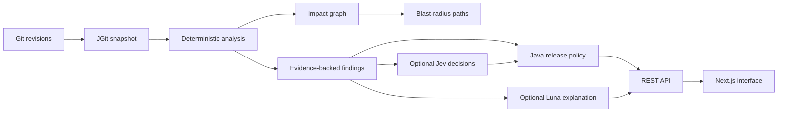

# ReleaseLens

ReleaseLens evaluates the release risk of a Git change before it is merged or deployed. It compares two committed revisions, produces deterministic findings with source evidence, maps supported relationships into an impact graph, and applies a release policy.

The central invariant is simple: **no evidence, no finding**. Every finding includes a repository-relative path, commit SHA, line range, symbol, and bounded source excerpt. Provider output can explain or prioritize the evidence, but it cannot create findings, graph relationships, or source locations.

## What ReleaseLens examines

- Git additions, removals, modifications, and renames through JGit
- Spring component, HTTP mapping, security, transaction, persistence, configuration, and Kafka annotations
- Java record DTO declarations
- Maven dependency and plugin declarations
- Flyway migration operations, including destructive DDL
- Application configuration keys
- The presence of adjacent test files for changed production Java files

## Architecture



Read [the architecture guide](docs/ARCHITECTURE.md) for ownership and data flow, [the analysis guide](docs/ANALYSIS_ENGINE.md) for supported rules, and [the API guide](docs/API.md) for request and response contracts.

## Run ReleaseLens

Install Java 27, Maven 3.6.3 or later, and Node 20.9 or later. Start the backend and frontend in separate terminals:

```powershell
mvn -pl backend spring-boot:run
```

```powershell
npm --prefix frontend run dev
```

The frontend is served at <http://127.0.0.1:3000> and the API at <http://127.0.0.1:8080>. See [running and configuration](docs/RUNNING.md) for build commands, configuration variables, and provider enablement.

## Providers and offline operation

ReleaseLens starts with provider enrichment disabled. Set `RELEASELENS_AI_ENABLED=true` together with `JEV_API_KEY`, `OPENAI_API_KEY`, and `SPRING_AI_MODEL_CHAT=openai` to enable Jev decisions and GPT-5.6 Luna summaries. The backend reads these variables; the browser never receives provider keys.

The deterministic pipeline, policy, graph, persistence, API, and interface work without either provider key. See [security boundaries](docs/SECURITY.md) and [decision behavior](docs/DECISION_ENGINE.md).

## Sample scenarios

The [commerce-platform fixture](sample-apps/commerce-platform/README.md) and [demo guide](docs/DEMO_SCENARIOS.md) cover API and DTO changes, security changes, destructive migrations, event changes, configuration changes, and internal refactoring.

## Constraints

ReleaseLens establishes only relationships it can support with repository evidence. Dynamic wiring, reflection, generated code, and SQL behavior specific to a database dialect can require manual review. Provider summaries remain explanatory and never override deterministic severity or policy decisions.
