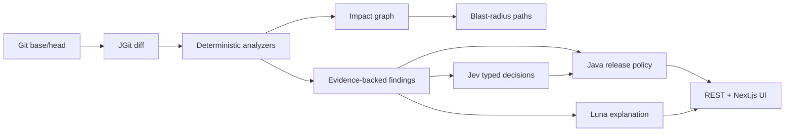

# ReleaseLens

**Know what your Spring Boot change can break before you release it.**

ReleaseLens is a local-first change-impact and release-readiness tool. It reads two Git revisions, performs deterministic Java/Spring/Maven/configuration/migration analysis, builds evidence-carrying impact paths, and applies a release policy. Jev and GPT-5.6 Luna are optional enrichment layers; the offline result remains useful without either key.

## Run locally

Install Java 27, Maven 3.6.3+, and Node 20.9+. Use `.env.example` as a reference for server environment variables, then run:

```powershell
.\scripts\start-local.ps1
```

Open <http://localhost:3000>. The backend listens on <http://127.0.0.1:8080>. AI is disabled by default. To enable it, set `RELEASELENS_AI_ENABLED=true`, `JEV_API_KEY`, `OPENAI_API_KEY`, and `SPRING_AI_MODEL_CHAT=openai` in the server environment. The startup scripts do not load a dotenv file automatically.

## What it analyzes

The deterministic engine detects changed files and revisions with JGit, Spring stereotypes and mappings, security annotations, records and DTO surfaces, Maven metadata, configuration keys, Kafka listener declarations, and Flyway operations. Every finding carries a repository-relative file, revision, line range, symbol, and snippet. A finding without evidence cannot be emitted.

## Architecture



## Limitations

Dynamic runtime wiring, reflection, generated sources, and SQL dialect-specific behavior may remain unresolved. The tool reports only relationships it can establish from source evidence. AI output cannot add findings, graph nodes, or source locations.

See [docs/ARCHITECTURE.md](docs/ARCHITECTURE.md), [docs/ANALYSIS_ENGINE.md](docs/ANALYSIS_ENGINE.md), [docs/API.md](docs/API.md), and [docs/SECURITY.md](docs/SECURITY.md).
